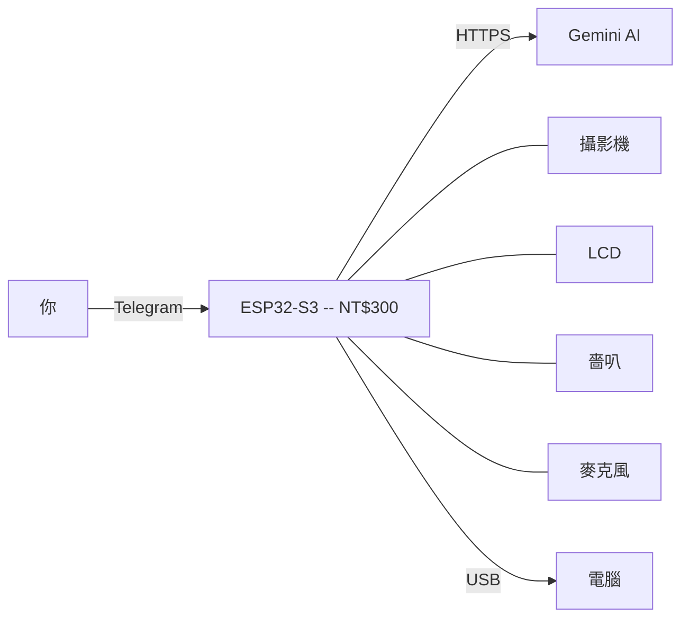
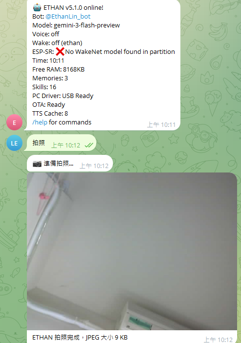
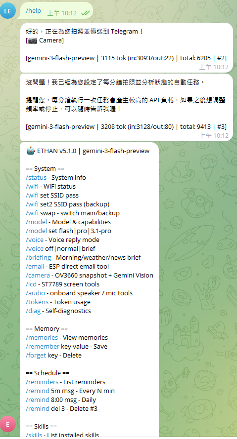
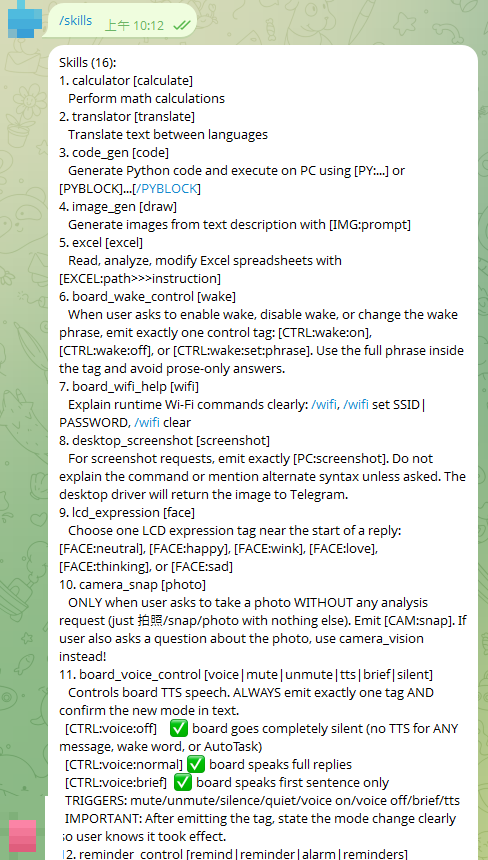
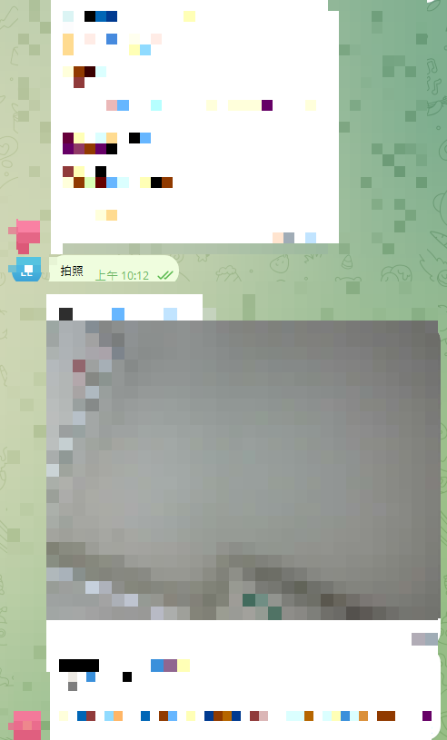
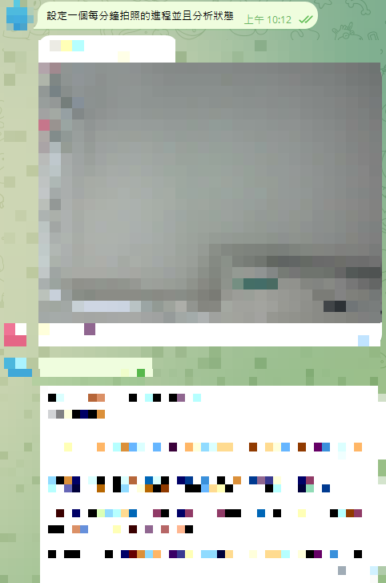
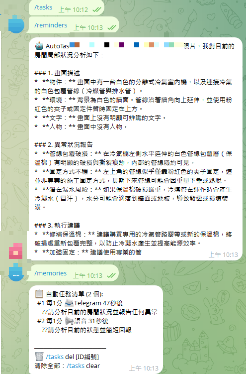
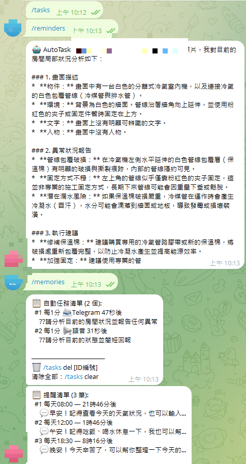
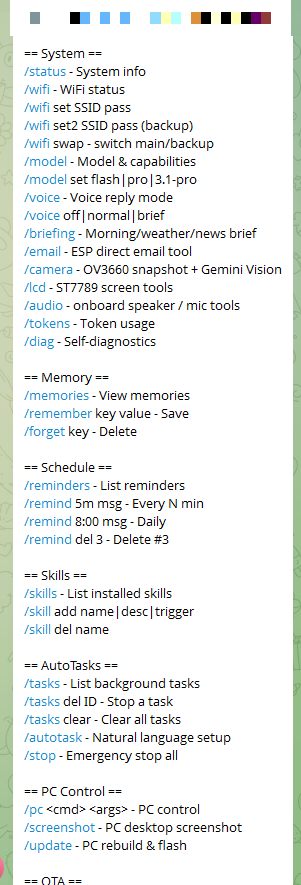
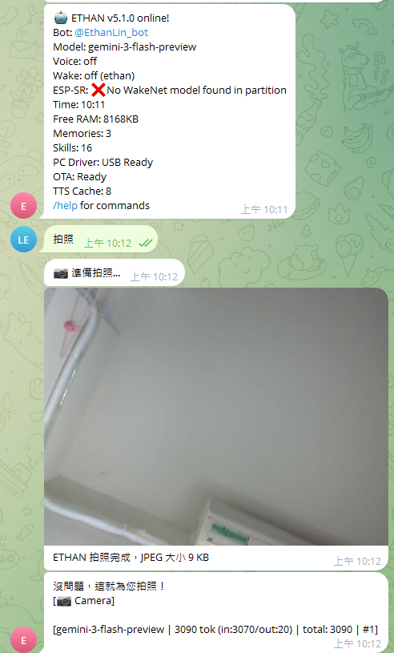

<h1 align="center">
  Novaclaw
</h1>

<h3 align="center">完整 AI 助手運行在一顆 $10 美元的微控制器上<br>不需要伺服器、不需要電腦、不需要寫程式 — 只要 WiFi</h3>

<p align="center">



</p>

<p align="center">
  <a href="README.md">English</a> ·
  <a href="README.zh-TW.md"><b>繁體中文</b></a> ·
  <a href="README.ja.md">日本語</a>
</p>

<p align="center">
  <a href="https://github.com/ry6612-pixel/Novaclaw/stargazers"></a>&nbsp;
  <a href="#快速開始--5-分鐘"></a>&nbsp;
  <a href="#硬體"></a>&nbsp;
  <a href="LICENSE-MIT"></a>
</p>

---

## 什麼是 Novaclaw？

**Novaclaw** 是完全在 ESP32-S3 晶片上運行的獨立 AI 韌體。它連接 Telegram 和 Google Gemini，讓你擁有一個功能完整的 AI 助手 — 攝影機視覺、語音互動、遠端控制電腦、排程自動化 — 全部來自一塊不到一杯咖啡的開發板。

> **「用說話的方式來寫程式」** — 不用寫程式碼，只要 *告訴* Novaclaw 你想做什麼：
> - *「每 5 分鐘拍一張照，有人進房間就通知我」*
> - *「每 30 分鐘提醒我喝水」*
> - *「如果溫度超過 35°C，發 email 告訴我」*
>
> Novaclaw 會理解你的指令、建立自動化任務、然後自己執行 — 不用語法、不用 IDE、不用部署。

| 傳統 AI 方案 | Novaclaw |
|---|---|
| $500+ 電腦 24 小時運行 | **NT$300 ESP32 開發板，待機 0.5W** |
| Docker/Python 複雜設定 | **燒錄一次就完成** |
| 雲端訂閱月費 | **Gemini 免費方案** |
| 要寫程式才能自動化 | **Telegram 打字就好** |

---

## Novaclaw vs OpenClaw vs ZeroClaw

Novaclaw 與 OpenClaw、ZeroClaw 屬於完全不同的類別。後兩者是需要 host 作業系統的軟體 AI 平台 -- 可以跟在桌機、Raspberry Pi、雲端 VM、或任何 Linux/macOS/Windows 機器上。Novaclaw 則是直接在裸機 MCU 上運行的獨立韌體，不需要任何作業系統。

ZeroClaw 的 ESP32/Arduino 支援是作為 **「周邊代理」(peripheral agent)** -- 一個連回 ZeroClaw 主 Gateway 的感測橋接器。Novaclaw 的 ESP32 **就是**整個系統。

| | Novaclaw | ZeroClaw | OpenClaw |
|---|---|---|---|
| 架構 | MCU 獨立韌體 | CLI/Gateway 執行檔（需要 host OS） | Node.js Gateway（需要 host OS） |
| 語言 | Rust (esp-idf) | Rust | TypeScript |
| 運行環境 | ESP32-S3 (NT$300，裸機) | 任何有 OS 的裝置：Pi、SBC、桌機、雲端 | 桌機、伺服器 |
| 需要 Host OS | 不需要（裸機韌體） | 需要（Linux/macOS/Windows） | 需要（Node.js 執行環境） |
| 記憶體 | 8 MB (晶片內 PSRAM) | < 5 MB | > 1 GB |
| 二進位大小 | ~1.8 MB 韌體 | ~8.8 MB | ~28 MB (dist) |
| 通訊頻道 | Telegram | 22+ 頻道 | 22+ 頻道 |
| 硬體 | 內建攝影機、LCD、嗇叭、麥克風 | 周邊特性（ESP32 作為橋接） | 無 |
| 技能 | 16 個裝置內建 | 70+ 工具 + 外掛 | 5,400+ 社群 |
| 安裝 | 燒錄一次，USB 寫入密鑰 | install.sh + onboard | Node.js + 設定 |

**選擇 Novaclaw 的時機：**
- 你想要一個不需要任何 host OS、伺服器、或電腦的獨立 AI 裝置
- 你需要實體感測：攝影機視覺、環境監控、語音 I/O
- 你想要 NT$300、待機 0.5W 的邊緣 AI
- 你想用打字建立自動化，而不是寫程式

**選擇 ZeroClaw 或 OpenClaw 的時機：**
- 你需要 22+ 通訊頻道（WhatsApp、Slack、Discord、Signal 等）
- 你想要有數千個社群技能的外掛生態系
- 你需要多代理協作或瀏覽器自動化
- 你已經有一台有 OS 的機器來運行 Gateway

---

## 實機展示

> 真實截圖 — 運行在 ~NT$300 的 ESP32-S3-N16R8 開發板上。

<table>
<tr>
<td align="center" width="33%">
<br>
<b>開機與狀態</b><br>
<sub>系統啟動後透過 Telegram 報告完整狀態 — 韌體版本、AI 模型、RAM、已連接周邊、已安裝技能。</sub>
</td>
<td align="center" width="33%">
<br>
<b>指令選單</b><br>
<sub>40+ 個指令按類別分組：系統、記憶、排程、技能、相機、音訊、電腦控制、OTA。</sub>
</td>
<td align="center" width="33%">
<br>
<b>AI 對話</b><br>
<sub>支援任何語言的完整對話 AI。直接打字 — Novaclaw 用 Gemini 智慧回應。</sub>
</td>
</tr>
<tr>
<td align="center">
<br>
<b>相機拍照</b><br>
<sub>說「拍照」— OV3660 拍攝、上傳、將照片傳回你的 Telegram 聊天。</sub>
</td>
<td align="center">
<br>
<b>AI 視覺分析</b><br>
<sub>Gemini Vision 檢視照片 — 偵測物體、讀取文字、發現異常、給出建議。</sub>
</td>
<td align="center">
<br>
<b>電腦遠端控制</b><br>
<sub>截圖、Shell 指令、檔案操作、啟動程式 — 全部透過 Telegram 經 USB Serial 完成。</sub>
</td>
</tr>
<tr>
<td align="center">
<br>
<b>16 個 AI 技能</b><br>
<sub>程式碼執行、圖片生成、Excel 處理、Email、計算機、翻譯等。</sub>
</td>
<td align="center">
<br>
<b>自動任務</b><br>
<sub>用自然語言建立循環 AI 任務 —「每 10 分鐘拍照檢查有沒有異常」。</sub>
</td>
<td align="center">
<br>
<b>智慧排程</b><br>
<sub>每日提醒、間隔任務、觸發式技能 — 全部用自然語言建立。</sub>
</td>
</tr>
</table>

---

## 主要功能

| | 功能 | 說明 |
|---|---|---|
| | **Gemini AI 對話** | 完整對話 AI，支援上下文記憶，任何語言 |
| | **相機視覺** | OV3660 拍照 + Gemini Vision -- 物件偵測、OCR、異常報告 |
| | **語音 I/O** | 語音轉文字、TTS 語音播放、喚醒詞偵測 (ESP-SR) |
| | **電腦遠端控制** | USB Serial -- 截圖、Shell、檔案操作、啟動程式 |
| | **智慧排程** | 自然語言建立任務、每日提醒、循環 AutoTask |
| | **16 個 AI 技能** | 程式碼執行、圖片生成、Excel、Email、計算機、翻譯 |
| | **LCD 螢幕** | ST7789 螢幕 -- 狀態顯示、AI 回覆 |
| | **OTA 更新** | 透過 Telegram 傳送 .bin 檔案即可升級韌體 |
| | **WiFi 自動恢復** | 雙網路備援、自動重連、120 秒健康檢查 |
| | **自然語言程式設計** | 用打字建立自動化 -- 不需要寫程式 |
| | **安全控制** | PC 安全模式、OTA 僅限 HTTPS、串流 Token 驗證、聊天紀錄遮蔽 |

---

## 應用場景

| 場景 | 做法 | 範例 |
|------|------|------|
| **工廠** | 排程 + GPIO + AI 視覺 | 瘡疵篩選、設備監控 |
| **工地** | 定時拍照 + AI 分析 | 安全帽偵測、區域警報 |
| **智慧家庭** | 獨立智慧單元 | 門口辨識、長者安全 |
| **遠端桌面** | USB 連接電腦控制 | 截圖、腳本執行、Email 透過 Telegram |
| **辦公室** | 自然語言任務管理 | 發票掃描、自動排程 |

---

<a id="硬體"></a>

## 硬體

### 核心（必備）— 約 NT$300

| 元件 | 規格 | 價格 |
|------|------|------|
| **ESP32-S3-N16R8** | 16MB Flash / 8MB PSRAM | ~NT$250 |

> **最低需求：只要一塊 ESP32-S3 + USB 線 = 完整的 Telegram AI 助手。**

### 選配模組

| 模組 | 價格 | 啟用功能 |
|------|------|----------|
| OV3660 攝影機 | ~NT$100 | 相機拍照、AI 視覺 |
| ST7789 LCD | ~NT$60 | 狀態顯示 |
| MAX98357 嗇叭 | ~NT$30 | TTS 語音輸出 |
| INMP441 麥克風 | ~NT$30 | 語音輸入、喚醒詞 |

**完整配置：~NT$470** — 含攝影機、螢幕、語音、喇叭的完整 AI 助手。

---

<a id="快速開始--5-分鐘"></a>

## 快速開始 — 5 分鐘

### 事前準備

| 金鑰 | 取得方式 |
|------|----------|
| **Telegram Bot Token** | [@BotFather](https://t.me/BotFather) -> `/newbot` |
| **Gemini API Key** | [Google AI Studio](https://aistudio.google.com/apikey) |
| **WiFi SSID + 密碼** | 你家/公司的 WiFi |

### 從原始碼建置

```bash
git clone https://github.com/ry6612-pixel/Novaclaw.git
cd Novaclaw

# 1. 設定你的密鑰檔案（存放在 repo 外部）
.\setup-secure-config.ps1
notepad $HOME/.novaclaw/secrets/user_config.txt

# 2. 建置（二進位檔不含任何密鑰）
.\build.ps1

# 3. 燒錄
.\flash.ps1 -Port COM3

# 4. 透過 USB Serial 將密鑰寫入裝置 NVS
.\provision.ps1 -Port COM3
```

> **安全設計：** 密鑰 **絕不會** 被編譯進韌體。
> 密鑰在首次開機時透過 USB Serial 傳送到裝置，儲存在晶片內建的 NVS Flash。
> `.bin` 檔案可以安全地分享或發布。

<details>
<summary><b>建置前置需求</b></summary>

```bash
rustup install nightly
cargo install espup espflash
espup install
. ~/export-esp.sh   # Linux/Mac
# Windows: build.ps1 會自動處理環境
```

</details>

<details>
<summary><b>密鑰設定優先順序</b></summary>

`provision.ps1` 依下列順序尋找密鑰：
1. `-Config` 參數
2. `NOVACLAW_CONFIG` 環境變數
3. `NOVACLAW_CONFIG_DIR/user_config.txt`
4. `$HOME/.novaclaw/secrets/user_config.txt`
5. Repo 本地 `user_config.txt`（舊版備援）

</details>

---

## 指令參考

### 核心

| 指令 | 說明 |
|------|------|
| *（任何文字）* | AI 對話（自動偵測語言） |
| `/help` | 完整指令列表 |
| `/status` | 系統資訊 |
| `/model set flash\|pro` | 切換 Gemini 模型 |
| `/tokens` | Token 用量統計 |
| `/diag` | 自我診斷 |

### 相機與視覺

| 指令 | 說明 |
|------|------|
| `/camera snap` | 拍照 → 傳到 Telegram |
| `/camera vision` | 拍照 → Gemini AI 分析 |
| `/camera vision <提示>` | 拍照 → 自訂 AI 問題 |
| `/camera stream` | 啟動 MJPEG 串流 |

### 排程

| 指令 | 說明 |
|------|------|
| `/remind 5m 訊息` | 循環提醒 |
| `/remind 8:00 訊息` | 每天 8:00 |
| `/tasks` | 列出 AutoTask |
| `/stop` | 緊急停止所有任務 |
| `/pause` / `/resume` | 暫停 / 恢復 AI 處理 |

### 記憶與技能

| 指令 | 說明 |
|------|------|
| `/memories` | 查看儲存的記憶 |
| `/remember key value` | 儲存記憶 |
| `/skills` | 列出 AI 技能 |
| `/skill add name\|desc\|trigger` | 建立自訂技能 |

### 電腦控制（USB 連接）

| 指令 | 說明 |
|------|------|
| `/pc shell <cmd>` | 執行 Shell 指令 |
| `/screenshot` | 擷取電腦桌面 |
| `/pc type <text>` | 鍵盤輸入 |
| `/pc hotkey ctrl+c` | 傳送快捷鍵 |
| `/pc open <file/url>` | 開啟檔案或網址 |

### 語音與音訊

| 指令 | 說明 |
|------|------|
| `/voice off\|normal\|brief` | 語音回覆模式 |
| `/audio wake on\|off` | 喚醒詞偵測 |
| `/audio transcribe` | 錄音 → 語音轉文字 |

### WiFi 與維護

| 指令 | 說明 |
|------|------|
| `/wifi set SSID password` | 設定 WiFi |
| `/ota <https://url>` | OTA 韌體更新 |
| 傳送 `.bin` 檔案 | 透過 Telegram OTA |
| `/reset` | 恢復出廠設定 |

---

## 系統架構

```
┌─────────────────────────────────────────────┐
│              Telegram Bot API               │
└──────────────────┬──────────────────────────┘
                   │ HTTPS
┌──────────────────▼──────────────────────────┐
│            ESP32-S3 (Novaclaw)              │
│                                             │
│  ┌──────────┐ ┌──────────┐ ┌─────────────┐ │
│  │ Gemini   │ │ ESP-SR   │ │ AutoTask    │ │
│  │ AI Chat  │ │ WakeNet  │ │ Scheduler   │ │
│  └──────────┘ └──────────┘ └─────────────┘ │
│  ┌──────────┐ ┌──────────┐ ┌─────────────┐ │
│  │ OV3660   │ │ ST7789   │ │ I2S Audio   │ │
│  │ Camera   │ │ LCD      │ │ Spk + Mic   │ │
│  └──────────┘ └──────────┘ └─────────────┘ │
│  ┌──────────┐ ┌──────────┐ ┌─────────────┐ │
│  │ NVS      │ │ OTA      │ │ USB Serial  │ │
│  │ Memory   │ │ Update   │ │ PC Driver   │ │
│  └──────────┘ └──────────┘ └─────────────┘ │
└─────────────────────────────────────────────┘
         │ USB Serial (JSON Lines)
┌────────▼────────────────────────────────────┐
│  PC — Shell / Screenshot / Email / Files    │
└─────────────────────────────────────────────┘
```

---

## 接線圖

<details>
<summary><b>OV3660 攝影機 (DVP)</b></summary>

| 接腳 | GPIO | | 接腳 | GPIO |
|------|------|-|------|------|
| XCLK | 15 | | D4 | 12 |
| SDA | 4 | | D5 | 18 |
| SCL | 5 | | D6 | 17 |
| D0 | 11 | | D7 | 16 |
| D1 | 9 | | VSYNC | 6 |
| D2 | 8 | | HREF | 7 |
| D3 | 10 | | PCLK | 13 |

> 自訂接腳？透過 Telegram `/camera pins d0=11 d1=9 ...` — 儲存到 NVS。

</details>

<details>
<summary><b>ST7789 LCD (SPI)</b></summary>

RST=21, DC=47, BL=38, SCLK=19, MOSI=20, CS=45

> `/lcd pins rst=21 dc=47 bl=38 sclk=19 sda=20 cs=45 w=240 h=320`

</details>

<details>
<summary><b>嗇叭 + 麥克風 (I2S)</b></summary>

**MAX98357:** BCLK=46, LRC=14, DIN=48
**INMP441:** SCK=2, WS=1, SD=41

</details>

---

## 安全性

**已保護：**
- **二進位檔零密鑰** — 憑證透過 USB Serial 寫入 NVS，絕不編譯進韌體
- 原始碼零密鑰 — 憑證透過外部設定檔 (`~/.novaclaw/secrets/`)
- Chat ID 驗證 — 只回應授權使用者
- PC 安全模式（預設開啟）— AI 指令被封鎖；手動 `/pc_unlock` / `/pc_lock`
- OTA 僅限 HTTPS
- MJPEG 串流需要 Session Token
- 聊天內容不記錄到 Serial
- 速率限制 — 每分鐘最多 5 次 AI 呼叫

**已知風險：**
- 高權限遠端控制 — PC 指令、OTA、AI 自動化可以修改你的電腦
- 語音、照片、聊天傳送到 Google Gemini API
- Telegram OTA 不驗證韌體簽章
- MJPEG 串流在區域網路使用 HTTP

> ⚠️ **設計用於個人實驗。** 部署前請審查原始碼。

---

## 發布檢查清單

發布變更前：

```powershell
.\pre-publish-scan.ps1      # 必須顯示 ALL CHECKS PASSED
.\build.ps1                  # 必須編譯成功
.\flash.ps1                  # 燒錄到裝置
.\provision.ps1              # 將密鑰寫入 NVS
git status --short           # 必須乾淨
git push
```

---

## 常見問題

<details><summary><b>Gemini API 要錢嗎？</b></summary>
免費方案每天可處理數百個請求。內建速率限制（每分鐘 5 次）防止過度使用。
</details>

<details><summary><b>沒有攝影機 / LCD / 喇叭也能用嗎？</b></summary>
可以。最低需求只要 ESP32-S3。所有周邊都是選配，自動偵測。
</details>

<details><summary><b>支援中文 / 英文 / 日文 / ...？</b></summary>
支援。用什麼語言打字就用什麼語言回覆。
</details>

<details><summary><b>和 xiaozhi-esp32 有什麼不同？</b></summary>
xiaozhi-esp32 專注語音聊天。Novaclaw 專注自主邊緣 AI -- 攝影機視覺、排程、電腦控制、自然語言程式設計。兩者互補。
</details>

<details><summary><b>和 OpenClaw、ZeroClaw 有什麼不同？</b></summary>
OpenClaw 和 ZeroClaw 是需要 host OS（桌機、Raspberry Pi、雲端 VM 等）的軟體 AI 平台，支援 22+ 通訊頻道。它們的 ESP32 支援是作為周邊橋接。Novaclaw 是直接在 NT$300 ESP32-S3 裸機上運行的獨立韌體 -- 不需要 OS、不需要伺服器、不需要 Docker。詳見上方比較表。
</details>

---

## 貢獻

歡迎 PR！Fork -> 開分支 -> Commit -> PR。

---

## 授權

雙授權 [MIT](LICENSE-MIT) / [Apache-2.0](LICENSE-APACHE)。

> **署名聲明：** 如果您使用、Fork 或再發布 Novaclaw（全部或部分），請標註專案名稱 **NOVA-CLAW** 並附上本倉庫連結。兩種授權皆要求保留版權及授權聲明。

## 致謝

- **[Espressif](https://www.espressif.com/)** — ESP32-S3 晶片及 ESP-IDF 框架
- **[Google Gemini](https://ai.google.dev/)** — 多模態 AI API
- **[xiaozhi-esp32（小智）](https://github.com/78/xiaozhi-esp32)** — 開創性的 ESP32 AI 語音助手專案
- **ZeroClaw** — ESP32/Rust AI 代理平台；比較與靈感來源
